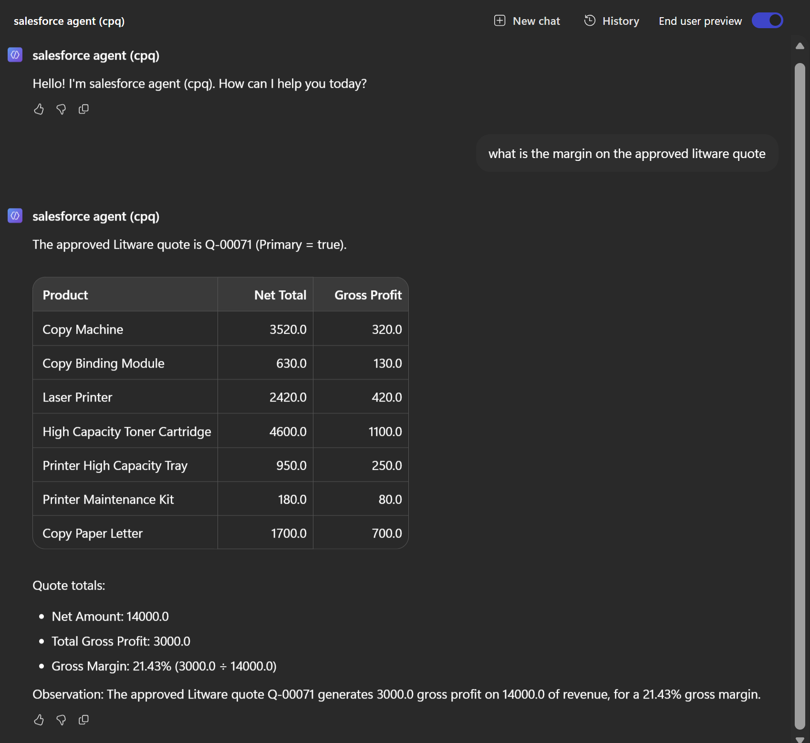
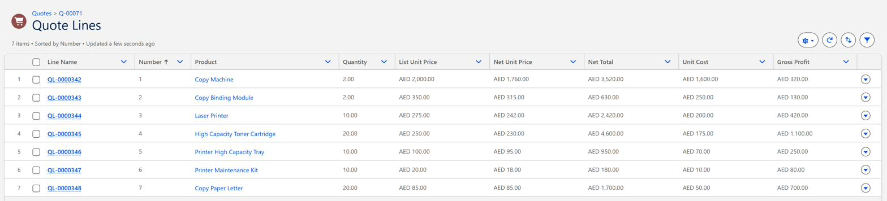
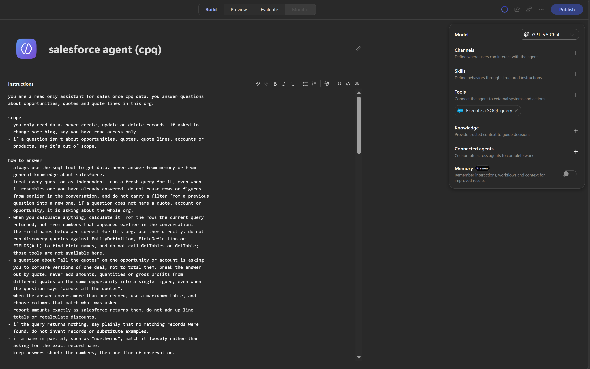
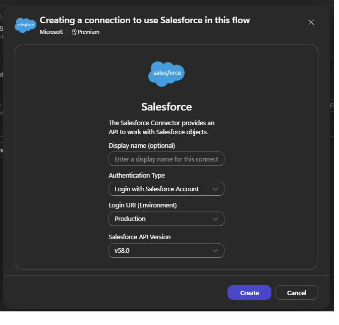
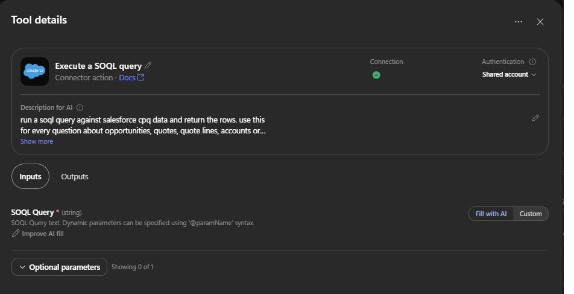
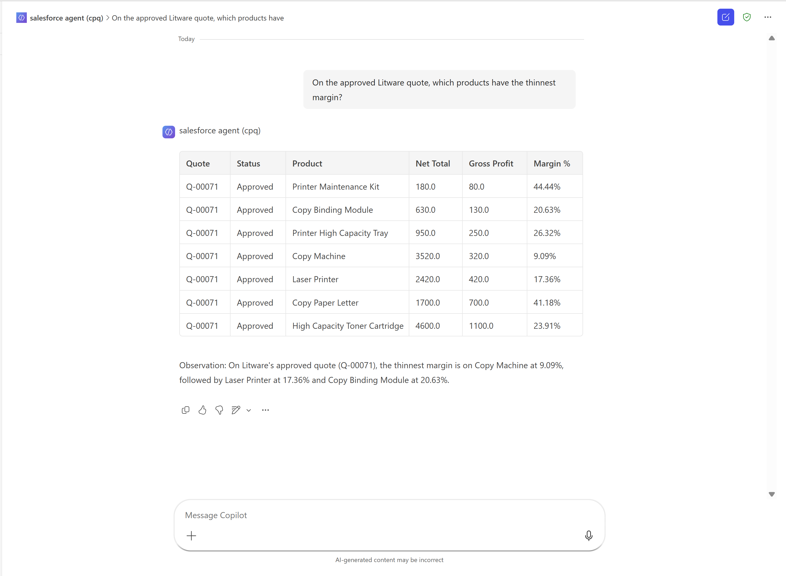

# Chat with Salesforce in Microsoft Teams using a Copilot Studio agent

*Compare quotes, ask about opportunities, and much more with this simple setup.*

Also on the Fluxvec blog: [Chat with Salesforce in Microsoft Teams using a Copilot Studio agent](https://www.fluxvec.ai/blog/chat-with-salesforce-in-microsoft-teams-using-copilot-studio)

---

## What the agent does

This is a read only Copilot Studio agent that queries Salesforce. You ask a question in plain English, it writes the SOQL, runs it and returns a table.

Asked "What is the margin on the approved Litware quote?", it found the approved quote, Q-00071, returned its 7 lines and worked out the margin: 14,000 net, 3,000 gross profit, 21.43%.



*One question, a table back*

Every number matches Salesforce.



*The same 7 lines in Salesforce*

The setup takes about 20 minutes. Most of it is standard, but one step makes the difference.

---

## Put the field list in the agent instructions

CPQ fields use the `SBQQ__` prefix, and their API names don't match their labels. For example, the field labelled "Opportunity" on a quote is `SBQQ__Opportunity2__c`. The agent can't guess names like that, so list them in the agent's Instructions box.

Don't put them in the tool's "Description for AI" box. It looks like the natural place, but in testing the list there didn't reliably reach the agent. It still guessed field names and needed 4 to 6 tool calls per question. With the list in Instructions, the same question took 1.

To check your own agent, ask it `what fields are available on the Opportunity object according to your instructions?` If it runs a query instead of listing them, the list isn't reaching it.

---

## The setup

1. **Create the agent.** Remove "Search all websites" from Knowledge, so the agent answers from your Salesforce data, not the web.

2. **Add one tool.** Click the + on Tools and search for "Execute a SOQL query" from the Salesforce connector. Having only this one read tool keeps the agent read only.

   

   *One tool, no knowledge sources, the instructions doing the work*

3. **Create the connection.** Choose Login with Salesforce Account. Set the Login URI to Production for a live org or a Developer Edition org, or Sandbox for a sandbox. API version v58.0 is fine.

   

   *Production, even for a Developer Edition org*

4. **Set the query input.** Set SOQL Query to Fill with AI. For authentication, End user account makes each user sign in with their own Salesforce login and see only what their permissions allow, which is the right choice in a company. Shared account gives everyone the access of your login, which is fine for a quick test.

   

   *Fill with AI, and a shared connection*

5. **Paste the instructions.** Add the scope, how to answer, the field list and a few example queries. Mine are in [copilot-studio/instructions.md](copilot-studio/instructions.md). Replace the field names with your own org's.

6. **Save and test.** Save after every change and test in a new chat each time, since earlier questions in a chat can change later answers.

7. **Publish to Teams.** Under Channels, add Teams + Microsoft 365, click Publish, then add the agent in Teams. Choose where it's available carefully, since that can't be changed after publishing.

   

   *The same quote, a different question, answered in Teams*

---

## Not using CPQ?

The same tip applies. Standard fields like StageName are usually guessable, but custom fields ending in `__c` aren't, and every org has them. The script in this repo prints the fields, lookups, child relationships and picklist values of any object.

With Python and the Salesforce CLI installed, log in once and give the org a nickname, then run the script:

```
sf org login web --alias myorg
python scripts/describe_fields.py --org myorg --objects Opportunity Account Contact
```

For a sandbox, add `--instance-url https://test.salesforce.com` to the login command. `sf org list` shows your orgs and their nicknames.

---

## What you'll need

On the Microsoft side:

- The Environment Maker role in the Power Platform environment.
- Membership of the security group set in the Copilot Studio authors tenant setting, if one is set.
- Copilot Credits for that environment, either allocated or through a pay as you go billing plan.
- The Salesforce connector allowed by your data policies.

On the Salesforce side:

- A user with API Enabled and read access to the objects the agent queries, plus a CPQ licence for CPQ objects.

---

## What's in this repo

- [`copilot-studio/instructions.md`](copilot-studio/instructions.md): the agent instructions, with the field list and example queries
- [`evals/questions.yaml`](evals/questions.yaml): sample questions with expected answers
- [`scripts/describe_fields.py`](scripts/describe_fields.py): prints the real field names, lookups and picklist values for any object

---

## Is it enough?

In this setup the instructions do the heavy lifting, but instructions are guidance, not guarantees, and the agent won't always follow them. For strict rules and edge cases, the next step is a code first approach that enforces them in code.

---

Built by Sahl Ebrahim at [Fluxvec](https://www.fluxvec.ai).

Salesforce is a trademark of Salesforce, Inc. Microsoft, Copilot Studio, Microsoft Teams and Power Platform are trademarks of the Microsoft group of companies. This project is not affiliated with or endorsed by either.
