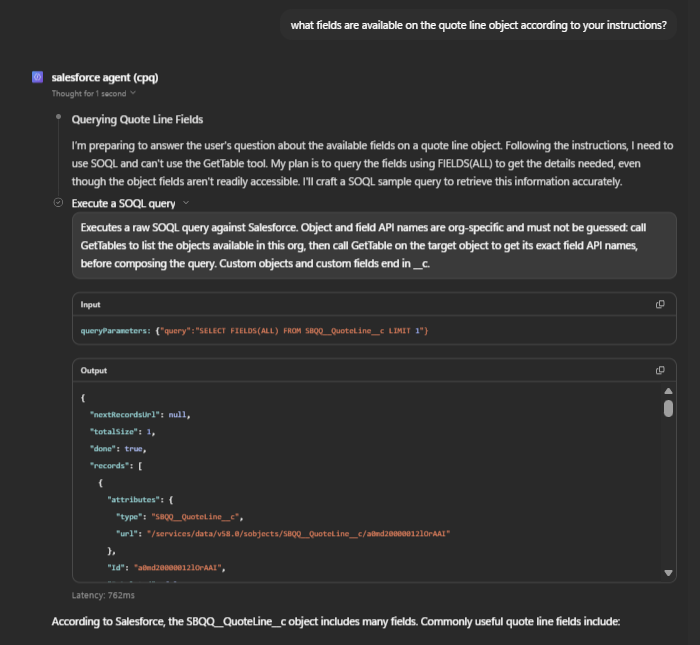
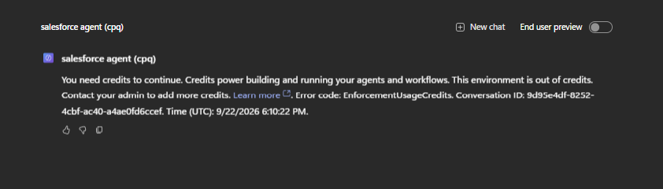
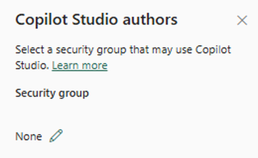

# Chat with Salesforce using a Copilot Studio agent

*Compare quotes, ask about opportunities, and much more with this simple setup.*

---

## What the agent is

Copilot Studio agents are custom AI assistants built with Microsoft Copilot Studio. In this blog, we set up a read only Copilot Studio agent that can query Salesforce: you ask a question in plain English, it writes the SOQL, runs it, and hands back a table.

We asked the agent, "What is the margin on the approved Litware quote?" It found the approved quote, Q-00071, returned all 7 lines and worked out the margin: 14,000 net, 3,000 gross profit, 21.43%.


*One question, a table back*

Every number is checkable. These are the same 7 lines in Salesforce.


*The same 7 lines in Salesforce*

The setup takes about 20 minutes and is mostly the same as any other tutorial. One step isn't.

---

## Put the field list in the agent instructions, not the tool's description

CPQ lives in a managed package with the `SBQQ__` prefix, and field names don't match their labels. For example, the field labelled "Opportunity" on a quote is `SBQQ__Opportunity2__c`. It's hard to guess, even for the agent, so it often guesses wrong and writes a query that fails. Hence we have to write the field names down for the agent in the agent instructions.

One mistake I made was putting the field names in the tool's "Description for AI" box, since it describes the tool. However, the agent never got them and spent 4 to 6 tool calls per question trying to get the query right.

I asked the agent what fields its instructions listed for the quote line object, and it was unable to answer. It ran a query against Salesforce to find them and answered "according to Salesforce". The only tool description it had seen was Copilot Studio's own, which told it to call GetTables and GetTable, tools this agent doesn't have.



*Asked what its instructions said, it went to Salesforce instead*

The fix was simple: move the field list to the agent's Instructions box. With the field names in front of it, the agent no longer wasted tool calls working out the query. The same question dropped from 4 tool calls to 1.

To check your own agent, ask it `what fields are available on the Opportunity object according to your instructions?`, using any object your agent works with. If it runs a query instead of listing them, your field list isn't reaching it.

---

## The setup

1. **Create the agent.** Remove "Search all websites" from Knowledge. Left on, the agent can answer from the web instead of from your Salesforce data.

2. **Add one tool.** Click the + on Tools and search for "Execute a SOQL query" from the Salesforce connector. This is the only tool this setup needs, and having only one read tool is what keeps the agent read only.

   

   *One tool, no knowledge sources, the instructions doing the work*

3. **Create the connection.** Clicking the tool will prompt you to create a connection. Choose Login with Salesforce Account, and set the Login URI to Production for a live org or a Developer Edition org, or Sandbox if you're connecting to a sandbox. API version v58.0 is fine.

   

   *Production, even for a Developer Edition org*

4. **Set the query input.** Set SOQL Query to Fill with AI. For authentication, you can choose Shared account, which lets every user see what your Salesforce login can see, or End user account, where each user signs in with their own Salesforce login and only sees what their permissions allow. End user account is the better choice in a company, since it respects each user's role. For this demo I'm using Shared account.

   

   *Fill with AI, and a shared connection*

5. **Paste the instructions.** Paste the detailed instructions into the Instructions box: scope, how to answer, the field list and a few example queries. Mine are in the repo at [copilot-studio/instructions.md](https://github.com/sahlebrahim/copilot-studio-salesforce-cpq/blob/main/copilot-studio/instructions.md). The field names are specific to my org, so replace them with your own.

6. **Save and test.** Don't forget to save after every change, and test after every save. Test in a new chat each time, because earlier questions in a chat can change later answers.

7. **Publish to Teams.** Under Channels, add Teams + Microsoft 365, then click Publish and add the agent in Teams. Choose where it's available carefully, since that setting can't be changed after publishing. Your colleagues can now ask it questions where they already work.

   

   *The same quote, a different question, answered in Teams*

---

## Not using CPQ?

Even if you are not using CPQ, the same tip applies: list the fields your agent needs in the instructions. Standard fields like StageName are often guessable, but custom fields ending in `__c` never are, and every org has them. The repo has a script that prints the fields of any object you want, along with its lookups, child relationships and picklist values.

You'll need Python and the Salesforce CLI. Log in to your org once with the CLI and give it a nickname:

```
sf org login web --alias myorg
```

For a sandbox, add `--instance-url https://test.salesforce.com` to that command.

Then run the script. For example, this gets you the fields of Opportunity, Account and Contact:

```
python scripts/describe_fields.py --org myorg --objects Opportunity Account Contact
```

Replace `myorg` with the nickname you chose. `sf org list` shows the orgs you've logged into and their nicknames.

---

## What you'll need access to

If you're building this at work, your admins will handle most of this. Here's what to ask for.

On the Microsoft side:

- The Environment Maker role in the Power Platform environment you're building in.
- Membership of the security group set in the Copilot Studio authors tenant setting, if your admin has set one.
- Copilot Credits available to that environment, either allocated or through a pay as you go billing plan.
- The Salesforce connector allowed by your organisation's data policies.

On the Salesforce side:

- A Salesforce user with API Enabled and read access to the objects the agent will query. For CPQ, the user also needs a CPQ licence.
- If signing in fails with `OAUTH_APPROVAL_ERROR_GENERIC`, your Salesforce admin may need to allow the Microsoft Power Platform app under Connected Apps OAuth Usage.

### Testing on your own

If you're testing this in your own trial tenant, like I did, you'll probably hit two walls.

The first was credits. Preview failed with `EnforcementUsageCredits`, because the Copilot Studio trial gave me seats, not credits. The fix was a pay as you go billing plan in the Power Platform admin center, backed by an Azure subscription in the same tenant as the environment.



*The first wall*

The second came right after fixing the first. Creating an agent failed with "User Admin license is disabled", even though I was Global Administrator. Pay as you go had moved authoring rights onto the Copilot Studio authors tenant setting, which was set to None. The fix was to create a Security group (not a Microsoft 365 group), add myself, pick it in that setting, and sign in again in a private window.



*The actual cause of the second wall*

Fixing the first causes the second, so budget an hour for both.

---

## Get the code

Everything is in the repo: [github.com/sahlebrahim/copilot-studio-salesforce-cpq](https://github.com/sahlebrahim/copilot-studio-salesforce-cpq)

- [`copilot-studio/instructions.md`](https://github.com/sahlebrahim/copilot-studio-salesforce-cpq/blob/main/copilot-studio/instructions.md): the agent instructions I used, with the field list and example queries
- [`evals/questions.yaml`](https://github.com/sahlebrahim/copilot-studio-salesforce-cpq/blob/main/evals/questions.yaml): sample questions with expected answers, taken from the org, to give you an idea of how to test
- [`scripts/describe_fields.py`](https://github.com/sahlebrahim/copilot-studio-salesforce-cpq/blob/main/scripts/describe_fields.py): prints the real field names, lookups and picklist values for any object in your org

---

## Is it enough?

This is a simple setup where the instructions do the heavy lifting, but the number 1 rule about agents is that instructions are non binding. The agent is not guaranteed to follow them strictly, and that's why the next step is a code first approach, which can handle edge cases and enforce the rules in code.